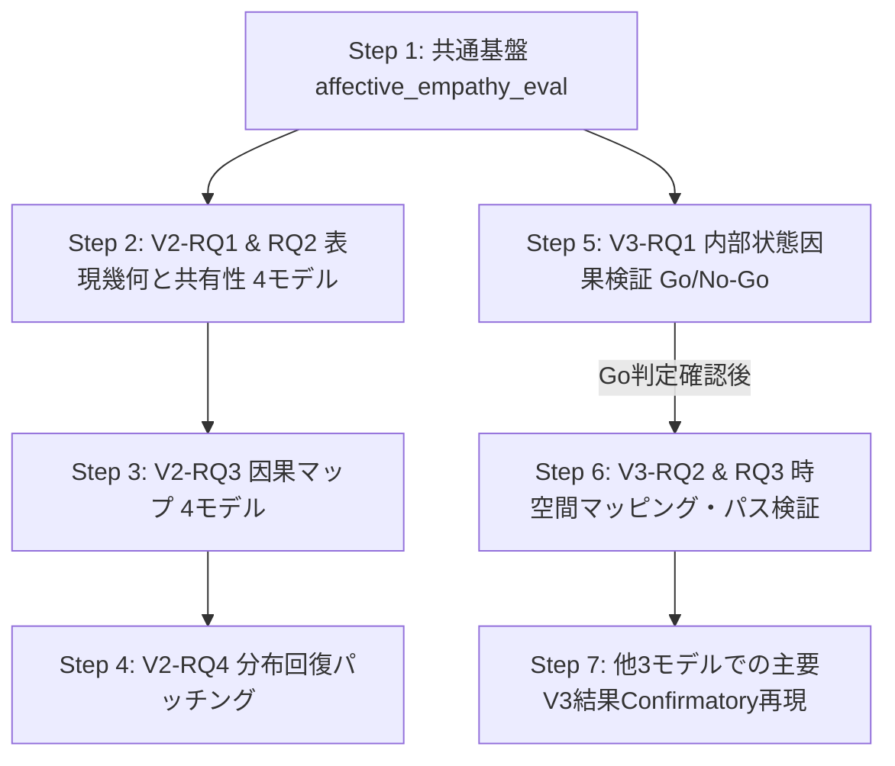

# V2・V3 再定義および複数モデルファミリー対応 実装計画書（改訂版）

## 1. 全体構造と各ステージの明確な役割分担

一連の研究を以下の論理的連鎖として位置づけます。

| Stage | 中心比較 | コア問い | 科学的焦点 |
|:---|:---|:---|:---|
| **Behavioral** | 出力行動 | ReaderとSelfの出力はどう関係するか？ | 出力レベルでの連動・単調性・同調 |
| **V1** | Reader vs Self | **Who shares what?**<br>（内部で何を共有しているか？） | 表現幾何と因果機構の部分的共有と不完全な交換可能性 |
| **V2** | Base vs Instruct $\times$ Reader vs Self | **What does post-training change?**<br>（事後学習で共有・分化構造がどう変わるか？） | $2\times 2$ 配置と「差の差（$\Delta\Delta_{\text{post}}$）」による内部計算再編の同定 |
| **V3** | Representation $\rightarrow$ Self-report | **How does an internal state become a self-report?**<br>（内部表現が自己報告へ変換される計算過程は何か？） | 内部状態参照の因果的証明、時空間的情報経路、結合ダイナミクス |

---

## 2. 4モデルファミリー横断比較のための基盤設計

### 2.1 対象モデルファミリー

| ファミリー | 規模 | Base モデル ID | Instruct モデル ID | 総層数 $L$ | 隠れ層 $H$ | 役割・選定理由 |
|:---|:---:|:---|:---|:---:|:---:|:---|
| **Qwen 2.5** | 1.5B | `Qwen/Qwen2.5-1.5B` | `Qwen/Qwen2.5-1.5B-Instruct` | 28 | 1536 | 既存基準モデル（V2/V3の全実験・時空間全探索の主軸） |
| **Llama 3.2** | 1B | `meta-llama/Llama-3.2-1B` | `meta-llama/Llama-3.2-1B-Instruct` | 16 | 2048 | Meta標準アーキテクチャ。軽量かつ最新アラインメント |
| **Gemma 2** | 2B | `google/gemma-2-2b` | `google/gemma-2-2b-it` | 26 | 2304 | Google系列。Gemma Scope等SAE資産が豊富 |
| **Mistral** | 7B | `mistralai/Mistral-7B-v0.1` | `mistralai/Mistral-7B-Instruct-v0.2` | 32 | 4096 | Sliding Window Attention、欧州系独立モデル |

### 2.2 正規化深度（Normalized Depth）の導入
層絶対数（16〜32層）の直接比較による交絡を防ぐため、全モデル共通の正規化深度 $d$ を導入します：
$$
d = \frac{l}{L - 1} \in [0.0, 1.0]
$$
- **Early** ($d \in [0.00, 0.25)$)
- **Early-middle** ($d \in [0.25, 0.50)$)
- **Late-middle** ($d \in [0.50, 0.75)$)
- **Late** ($d \in [0.75, 1.00]$)

### 2.3 モデル抽象化共通API（`ModelAdapter`）
各アーキテクチャの内部実装差を吸収する共通インターフェースを提供：
- `get_layers()`, `get_attn_module(layer)`, `get_mlp_module(layer)`, `get_final_norm()`, `get_lm_head()`
- フックポイントの概念名統一:
  - `pre_attn_resid`: アテンション前残差ストリーム
  - `post_attn_resid`: アテンション後残差ストリーム
  - `post_mlp_resid`: MLP後残差ストリーム（ブロック出力）
  - `attn_out`: アテンション単体出力（残差加算前）
  - `mlp_out`: MLP単体出力（残差加算前）

---

## 3. V2 再設計: Post-training による表現・因果利用の再編

### 3.1 中心RQ
> **How does post-training alter the representation and causal use of affective information across Reader and Self tasks?**

### 3.2 $2 \times 2$ 要因配置と「差の差（$\Delta\Delta_{\text{post}}$）」
$$
\Delta_{\text{post}}^R = M(R_{\text{Inst}}) - M(R_{\text{Base}}), \quad
\Delta_{\text{post}}^S = M(S_{\text{Inst}}) - M(S_{\text{Base}})
$$
中心統計量として以下を検定：
$$
\boxed{\Delta\Delta_{\text{post}} = \Delta_{\text{post}}^S - \Delta_{\text{post}}^R}
$$
事後学習による変化が「全般的な情動表現変化」なのか「Selfタスク特異的な出力マッピング変化」なのかを、線形混合効果モデルで直接検定：
$$
Y \sim \text{ModelType} \times \text{Task} + (1 \mid \text{pair})
$$
$$
Y \sim \text{ModelType} \times \text{Task} \times \text{Site} + (1 \mid \text{pair})
$$

### 3.3 4つのサブRQ
- **V2-RQ1（表現幾何の変化）**:
  - `Base Reader ↔ Instruct Reader`, `Base Self ↔ Instruct Self` の Cross-decoding, Procrustes, Ridge alignment, RSA。
  - 正規化深度 $d$ ごとに幾何歪み $\Delta_{\text{post}}^R(d)$ と $\Delta_{\text{post}}^S(d)$ を比較。
- **V2-RQ2（Reader–Self 共有性の変化）**:
  - $\text{CrossDecode}(R \rightarrow S)$ および $(S \rightarrow R)$ を Base と Instruct の双方で測定。
  - Post-trainingによる機能的分化（共有低下）か統合（共有向上）かを判定。
- **V2-RQ3（因果回路の再配置）**:
  - 4条件の因果マップ $C_{R,\text{Base}}(d, c)$, $C_{S,\text{Base}}(d, c)$, $C_{R,\text{Inst}}(d, c)$, $C_{S,\text{Inst}}(d, c)$ を構築。
  - $\text{Model} \times \text{Task} \times \text{Site}$ の交互作用（初期層 vs 後期層での特異化の分岐）。
- **V2-RQ4（Base/Instruct差の介入的再現・縮小）**:
  - Base activation パッチング（V3から移管した `run_aligned_cross_model_patching.py` を含む）や Component / Path パッチング、Norm/lm_head スワップによって、分布差 $D(P_{\text{Inst}}, P_{\text{Base}})$ を縮小できる部位を同定。

---

## 4. V3 再設計: 内部表現から自己報告への計算プロセス

### 4.1 中心RQ
> **How and when does an internal affective representation become a self-report?**

### 4.2 「自己報告が内部状態を因果的に参照している」判定基準（5 Criteria）
1. **Sufficiency**: 入力固定下でも内部状態操作により自己報告が系統的に変化する。
2. **Necessity**: 内部情動方向の射影除去により、刺激提示に伴う自然な報告変位が低減する。
3. **Specificity**: ランダム・直交方向への介入に比べ、情動固有方向への介入効果が有意に大きい。
4. **Dose Response**: 介入強度 $\alpha$ に応じて出力分布が単調かつ系統的にシフトする。
5. **Cross-Sample Generalization**: 方向ベクトルを算出したサンプルとは完全に独立な held-out サンプルで成立する。

> [!NOTE]
> 論文中の表現は哲学的な "introspection" を避け、**"Self-reports are causally sensitive to affect-relevant internal computational states."** と定義します。

### 4.3 V3-RQ1: 内部状態参照の因果的検証（Go/No-Go判定）
- **Train/Test 完全分離**:
  - Train pairs から情動方向 $d_{\text{affect}}^{\text{train}} = \mathbb{E}[h_{\text{aff}}^{\text{train}}] - \mathbb{E}[h_{\text{neu}}^{\text{train}}]$ を抽出。
  - Held-out test pairs の $h_{\text{test}} + \alpha d_{\text{affect}}^{\text{train}}$ に注入（循環回避）。
- **Projection Removal による Necessity**:
  - $\hat{d} = \frac{d}{\|d\|}$ に対し、$h_{\text{removed}} = h - (h^\top \hat{d})\hat{d}$ として情動成分のみ直交射影除去。
- **統制方向（Random & Orthogonal Controls）**:
  - ノルムを揃えたランダム方向 $d_{\text{random}}$ および直交方向 $d_{\perp}$ に対する優位性を確認（高次元破壊アーティファクトの排除）。
- **Task Selectivity のオープンな検証**:
  - 事前に「Self > Reader」と決めつけず、以下のいずれかをデータ駆動で識別：
    - (a) **Shared state**: $\text{Effect}(\text{Self}) \approx \text{Effect}(\text{Reader}) \gg \text{Effect}(\text{Control})$
    - (b) **Self-specific readout**: $\text{Effect}(\text{Self}) \gg \text{Effect}(\text{Reader}) \approx \text{Effect}(\text{Control})$
    - (c) **Shared + Amplification**: $\text{Effect}(\text{Self}) > \text{Effect}(\text{Reader}) \gg \text{Effect}(\text{Control})$
- **非感情 Control タスク**:
  - 同一テキストを入力として判定可能なトピック分類（Topic/Domain classification）や文法判定等。

### 4.4 V3-RQ2: 空間的情報経路の同定（Decodability ≠ Causal Leverage）
- 既存知見の保持: 中間層でデコード力最大・因果力小、後期残差でデコード力低・生成時因果力大。
- **Data-driven Site 同定 & Train/Test 分離**:
  - Discovery split でピーク層を同定: $l_D^* = \arg\max_l D(l)$, $l_C^* = \arg\max_l C(l)$。
  - Confirmatory split で経路パッチング（Path Mediation: $l_D^* \rightarrow \dots \rightarrow l_C^* \rightarrow \text{Logits}$）を実行し、情報伝達経路を直接遮断・評価。

### 4.5 V3-RQ3: 時空間結合マップの構築
- **刺激交絡の除去**:
  - 単純相関ではなく、刺激情動値や文長を統制した共変量モデル、およびペア差分 $\Delta z_{l,t}$ と $\Delta \text{Report}$ による結合度測定。
- **4階層マップ**:
  1. $D(l, t)$: **Representational Availability**（線形プローブ復元力）
  2. $\beta(l, t)$: **Observational Coupling**（内部表現スコアと報告値の条件付き結合）
  3. $\gamma(l, t) = \frac{\Delta \text{Report}}{\Delta z}$: **Interventional Coupling**（内部操作に対する報告の感度）
  4. $C(l, t)$: **Direct Causal Leverage**（生成時パッチングによる分布シフト力）

---

## 5. 計算リソース配分とモデル実行戦略

- **V2**: 4モデルファミリー（Qwen 1.5B, Llama 1B, Gemma 2B, Mistral 7B）すべてで実行し、事後学習による再編の一般性を検証。
- **V3**:
  - **Qwen 2.5 (1.5B)**: 全実験・時空間全探索を実施する主解析モデル。
  - **Llama / Gemma / Mistral**: 以下の主要な Confirmatory 実験に絞って再現性を確認（計算爆発の防止）：
    1. Peak Decodability $\neq$ Peak Causal Site の解離
    2. Sufficiency（内部状態注入）
    3. Necessity（射影除去）
    4. Temporal Emergence（生成時の因果力立ち上がり）

---

## 6. パッケージ・ディレクトリ構成

共通ロジックはルート `src/affective_empathy_eval/` に集約・整理：

```
emo/
├── configs/
│   ├── models.yaml                      # 4モデルファミリー定義
│   ├── v2_experiments.yaml              # V2実験パラメータ
│   └── v3_experiments.yaml              # V3実験パラメータ
├── src/
│   └── affective_empathy_eval/
│       ├── models/
│       │   ├── __init__.py
│       │   ├── registry.py              # 4ファミリー定義ローダー
│       │   ├── adapters.py              # Qwen, Llama, Gemma, Mistral 共通Adapter
│       │   └── hooks.py                 # 概念名フック・パッチ・射影除去
│       ├── prompts.py                   # Self, Reader, Control統一プロンプト
│       ├── likelihood.py                # 81状態・VAD尤度算出
│       ├── interventions.py             # 状態注入・射影除去・ランダム統制
│       ├── geometry.py                  # Procrustes, Ridge, RSA, 正規化深度
│       └── statistics.py                # LMM (ΔΔ_post), FDR, Bootstrap CI
├── v2/
│   ├── README.md                        # 2x2フレームワーク版
│   └── scripts/
│       ├── run_v2_2x2_cross_decoding.py # V2-RQ1 & RQ2
│       ├── run_v2_2x2_causal_map.py     # V2-RQ3
│       ├── run_v2_recovery_patching.py  # V2-RQ4
│       └── run_aligned_cross_model_patching.py # V3から移管
├── v3/
│   ├── README.md                        # State-to-Reportフレームワーク版
│   └── scripts/
│       ├── run_v3_state_induction.py    # V3-RQ1 (Sufficiency, Necessity, Controls)
│       ├── run_v3_path_mediation.py     # V3-RQ2 (Data-driven Path Mediation)
│       └── run_v3_spatiotemporal_maps.py# V3-RQ3 (D, β, γ, C 時空間マップ)
└── docs/
    └── v2_v3_redefinition_and_cross_family_restructuring/
        ├── task.md
        ├── implementation_plan.md
        └── walkthrough.md
```

---

## 7. 段階的実装順序（Roadmap）



- **全スクリプト必須機能**: `--dry-run`, `--max-samples 2`, `--device cpu/cuda` を完備し、安全かつ迅速なスモークテストを保証。
