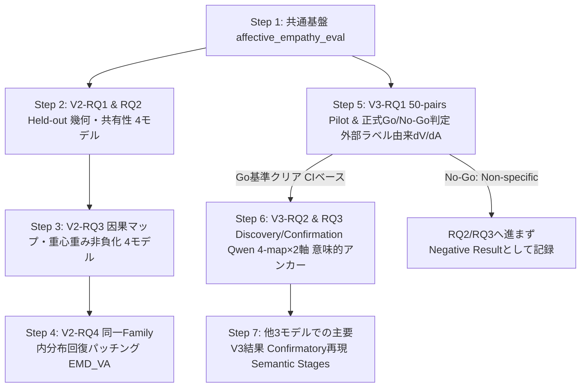

# V2・V3 再定義および複数モデルファミリー対応 実装計画書（最終仕様固定版）

ユーザーからのフィードバックに基づき、**「① 外部刺激情動ラベルによる $d_V, d_A$ 推定（循環論法の完全排除）」**、**「② 重回帰による条件付き方向推定と QR 分解による直交基底化」**、**「③ 意味的生成アンカー（Semantic Generation Anchors）による時空間軸 $t$ の固定」**、**「④ 因果変位 $C_V(l, t), C_A(l, t)$ の厳密な数学的定義」**を完全に組み込んだ、実装直前の最終仕様固定版です。

---

## 1. 全体構造と各ステージの明確な役割分担

本研究プログラムは以下の厳密な論理的連鎖として体系化・固定されます。

$$
\boxed{\text{Behavioral}: \text{Do Reader and Self covary?}}
$$
$$
\downarrow
$$
$$
\boxed{\text{V1}: \text{What representations and causal mechanisms do they share?}}
$$
$$
\downarrow
$$
$$
\boxed{\text{V2}: \text{How does post-training reorganize shared and task-specific computation?}}
$$
$$
\downarrow
$$
$$
\boxed{\text{V3}: \text{When and where does affect-relevant information acquire causal leverage over self-report?}}
$$

| Stage | 中心比較 | コア問い | 科学的焦点 |
|:---|:---|:---|:---|
| **Behavioral** | 出力行動 | **Do Reader and Self covary?** | 出力レベルでの連動・単調性・同調（自己報告情動の行動特性） |
| **V1** | Reader vs Self | **What representations and causal mechanisms do they share?** | 表現幾何と因果機構の部分的共有と不完全な交換可能性 |
| **V2** | Base vs Instruct $\times$ Reader vs Self | **How does post-training reorganize shared and task-specific computation?** | $2\times 2$ 配置と「差の差（$\Delta\Delta_{\text{post}}$）」による内部計算再編の同定（4 Family再現性検証） |
| **V3** | Representation $\rightarrow$ Self-report | **When and where does affect-relevant information acquire causal leverage over self-report?** | 外部ラベル由来の内部状態への因果的依存性、Availability $\rightarrow$ Association $\rightarrow$ Interventional Coupling $\rightarrow$ Causal Utilization の時空間遷移 |

> **論文全体を貫くコアストーリー:**  
> *"V1 establishes partial sharing, V2 characterizes how post-training reorganizes that sharing, and V3 identifies when and where affect-relevant internal information acquires causal leverage over self-report."*

---

## 2. 4モデルファミリー横断比較のための基盤設計

### 2.1 対象モデルファミリーと変数命名
- **Alignment**: `Base` / `Instruct`
- **Family**: `Qwen` / `Llama` / `Gemma` / `Mistral`（4水準）
- **Task**: `Reader` / `Self` / `Control`

| ファミリー | 規模 | Base モデル ID | Instruct モデル ID | 総層数 $L$ | 隠れ層 $H$ | 役割・選定理由 |
|:---|:---:|:---|:---|:---:|:---:|:---|
| **Qwen 2.5** | 1.5B | `Qwen/Qwen2.5-1.5B` | `Qwen/Qwen2.5-1.5B-Instruct` | 28 | 1536 | 主軸探索モデル（V2/V3全空間探索の基準） |
| **Llama 3.2** | 1B | `meta-llama/Llama-3.2-1B` | `meta-llama/Llama-3.2-1B-Instruct` | 16 | 2048 | Meta標準。軽量かつ最新アラインメント |
| **Gemma 2** | 2B | `google/gemma-2-2b` | `google/gemma-2-2b-it` | 26 | 2304 | Google系列。SAE資産・異なる活性化関数 |
| **Mistral** | 7B | `mistralai/Mistral-7B-v0.1` | `mistralai/Mistral-7B-Instruct-v0.2` | 32 | 4096 | Sliding Window Attention、欧州系独立モデル |

### 2.2 相対計算深度（Relative Computational Depth）の事前固定
層数差（16〜32層）を直接比較するのではなく、相対計算深度 $d = \frac{l}{L - 1} \in [0.0, 1.0]$ を導入（relative computational depth として解釈）。

- **非線形プロファイルへの対応（事前固定）**:
  - **Primary**: 連続変数 $d$ を用いた解析。
  - **Confirmatory / Auxiliary**: 4-bin カテゴリ変数（`Early`, `Early-middle`, `Late-middle`, `Late`）、および Natural Cubic Spline（3ノット: $d=0.25, 0.50, 0.75$）による非線形効果検証を事前固定。

### 2.3 ピーク深度および重心指標の数学的定義（重み非負化）
平坦プロファイルでの $\arg\max$ 不安定性を防ぐため、重みを非負化（$w_l = \max(M_l, 0)$）した重心指標および Bootstrap 95% CI を併用：
$$
d_D^* = \arg\max_d D(d), \qquad \bar{d}_D = \frac{\sum_l d_l \max(D_l, 0)}{\sum_l \max(D_l, 0)}, \qquad \text{CI}_{95\%}(d_D^*)
$$
$$
d_C^* = \arg\max_d C(d), \qquad \bar{d}_C = \frac{\sum_l d_l \max(C_l, 0)}{\sum_l \max(C_l, 0)}, \qquad \text{CI}_{95\%}(d_C^*)
$$
$$
\Delta d^* = d_C^* - d_D^*, \qquad \Delta \bar{d} = \bar{d}_C - \bar{d}_D
$$

---

## 3. V2 再設計: Post-training による表現・因果利用の再編

### 3.1 中心RQ
> **How does post-training alter the representation and causal use of affective information across Reader and Self tasks?**

### 3.2 統計解析の明確な2階層分離（Sample-level vs Aggregate-level）

#### (1) Sample-level 解析（観測値・ペア単位指標）
介入効果、報告値シフト、表現スコアなど、刺激ペア単位の観測値を持つデータに対しては**線形混合効果モデル（LMM）**を適用：
- **主仮説検定（Primary Models）**:
  $$Y \sim \text{Alignment} \times \text{Task} + \text{RandomEffects}$$
  $$Y \sim \text{Alignment} \times \text{Task} \times \text{Depth} + \text{RandomEffects}$$
- **Random Effects 構造の選定ルール（事前固定）**:
  1. `Random Intercept`: $(1 \mid \text{pair})$
  2. `Random Slope`: $(1 + \text{Alignment} + \text{Task} \mid \text{pair})$
  3. 特異フィット（Singular fit）および収束性を自動診断。特異性警告・収束失敗が出ない範囲で最大のモデルを採用し、安定する方を Primary とする。
- **Family 異質性・再現性解析（Heterogeneity Analysis）**:
  - 各 Family 内で個別に効果（$\Delta\Delta_{\text{post}}$）を推定し、4つの独立モデルファミリーで方向性が一貫して再現するかを検証。必要に応じてメタアナリシス統合。

#### (2) Aggregate-level 解析（スプリット・層単位集約指標）
Cross-decoding $R^2$、RSA、Procrustes alignment score、ピーク深度 $d^*$ など、データセット全体から算出される集約値に対しては、LMM ではなく以下のリサンプリング検定を適用：
- **Bootstrap across pairs / splits**: 刺激ペアのリサンプリングによる 95% 信頼区間 $\text{CI}_{95\%}$ の算出。
- **Paired Family Comparison**: 4 つの Family をペアとした符号順位検定または置換検定。

### 3.3 評価プロトコルの厳格化
1. **Held-out 幾何評価の義務化**:
   - Train split で学習（Probe / Procrustes / Ridge）し、完全独立な Held-out test split で評価。
2. **Base/Instruct プロンプト形式交絡の統制**:
   - Semantic content 完全一致、Instruction 構造統一、公式 chat template 記録。
   - 補助解析: `Native format` と `Matched plain-text format` を比較。
   - 意味的アンカー（`stimulus_end`, `instruction_end`, `response_start`）での位置整合。
3. **パッチングの同一Family内限定**:
   - 同一 Family 内の Base $\leftrightarrow$ Instruct パッチングのみを原則とする（モデル間パッチングは除外）。
4. **$\text{EMD}_{VA}$ の Ground Cost 事前定義**:
   - 81格子上のユークリッド距離 $c((v, a), (v', a')) = \sqrt{(v - v')^2 + (a - a')^2}$ を事前定義。
   - **Primary Metric**: $\text{EMD}_{VA}$（Joint 81状態 2D EMD）
   - **Secondary Metrics**: $W_1(P_V, Q_V)$, $W_1(P_A, Q_A)$, $\text{JSD}$

---

## 4. V3 再設計: 内部表現から自己報告への計算プロセス

### 4.1 中心RQ
> **When and where does affect-relevant information acquire causal leverage over self-report?**

### 4.2 外部刺激情動ラベルによる $d_V, d_A$ の条件付き推定（循環論法の完全排除）
自己報告そのものを予測する方向を操作して自己報告が変わるという「readout 自明性」の反論を完全に排除するため、**自己報告から完全に独立した外部ラベル**を用いて情動方向を定義します：
$$
\boxed{V, A = \text{External Human/Stimulus Affect Labels}}
$$
（EmoBank の Human V/A、AIPsy-Affect の外部刺激属性、または Train split の Human Reader Annotation）

残差ストリーム活性化 $h$ に対し、多変量回帰により他軸を条件付き統制した偏回帰ベクトルを抽出：
$$
h = \beta_V V + \beta_A A + \epsilon
$$
$$
\boxed{d_V = \frac{\beta_V}{\|\beta_V\|_2}, \qquad d_A = \frac{\beta_A}{\|\beta_A\|_2}}
$$
※ $\beta_V, \beta_A$ は相互の交絡が統制された条件付き方向であり、必ずしも互いに直交するわけではありません。  
※ モデル自身の Self-report から抽出した方向は Secondary（対照比較用）として保持。

さらに 2D アフェクティブ部分空間（Affective Subspace）を構成する場合は、基底行列 $B = [d_V, d_A] \in \mathbb{R}^{H \times 2}$ に対し **QR 分解** を適用して正規直交基底 $Q \in \mathbb{R}^{H \times 2}$（$Q^\top Q = I_2$）を構成し、射影行列を定義します：
$$
B = QR, \qquad \boxed{P_{\mathcal{A}} = QQ^\top, \qquad h'_{\mathcal{A}} = h - QQ^\top(h - \mu_{\text{neu}})}
$$

### 4.3 意味的生成アンカー（Semantic Generation Anchors）による時空間軸 $t$ の固定
JSON 生成時のトークナイズのモデル間差異による位置ズレを完全に排除するため、時空間軸 $t$ を以下の**意味的生成ステージ（Semantic Generation Stages）**として事前定義します：
$$
\boxed{t \in \{\text{response\_start}, \text{pre\_V}, \text{V\_value}, \text{pre\_A}, \text{A\_value}, \text{response\_end}\}}
$$
- **Qwen 主探索**: トークン単位の高解像度マップも描画。
- **モデル横断 Confirmation**: 全モデル共通で **$\text{Layer} \times \text{Semantic Generation Stage}$** の 2 次元グリッドで直接比較。

### 4.4 4-Map 体系の Primary Definition の完全一意化

| 指標 | 概念名 | Primary Definition（事前固定） | 科学的問い |
|:---|:---|:---|:---|
| **$D(l, t)$** | **Decodability** | **Held-out Probe $R^2$** ($D_V = R^2_{\text{held-out}}(V), D_A = R^2_{\text{held-out}}(A)$) | **Availability**: 情報はそこに存在するか？ |
| **$\beta(l, t)$** | **Observational Coupling** | **刺激共変量を統制した観察的偏回帰係数** | **Association**: 自然状態で報告と結びつくか？ |
| **$\gamma(l, t)$** | **Interventional Coupling** | **複数 $\alpha$ 介入による $\Delta z \rightarrow \Delta \text{Report}$ の回帰傾き** ($\gamma = \frac{\partial \Delta \text{Report}}{\partial \Delta z}$) | **Responsiveness**: 内部操作に追従して報告が動くか？ |
| **$C(l, t)$** | **Causal Leverage** | **生成時パッチングによる絶対変位量** ($C_V = \|\mathbb{E}[V]_{\text{patched}} - \mathbb{E}[V]_{\text{base}}\|, C_A = \|\mathbb{E}[A]_{\text{patched}} - \mathbb{E}[A]_{\text{base}}\|$) | **Causal Utilization**: 出力決定ボトルネックか？ |

- 符号付き因果変位 $C_V^{\text{dir}} = \mathbb{E}[V]_{\text{patched}} - \mathbb{E}[V]_{\text{base}}$ も記録。
- Joint 分布の総合変位量として $\text{EMD}_{VA}$ を補助的に算出。
- Valence 4-Map（$D_V, \beta_V, \gamma_V, C_V$）と Arousal 4-Map（$D_A, \beta_A, \gamma_A, C_A$）の計 8 マップを完全分離描画。

### 4.5 介入プロトコルと判定基準
1. **Centered Projection Removal (Necessity Primary: 1D)**:
   $$h_c = h - \mu_{\text{neu}}, \qquad \boxed{h'_V = h - \left[(h - \mu_{\text{neu}})^\top d_V\right]d_V}$$
2. **Topic Control と No-Go 判定**:
   - Topic Control（medical / family / work / daily life）を用いた対照実験。
   - Non-specific perturbation（$\text{Self} \approx \text{Reader} \approx \text{Control}$）が観測された場合は、**RQ2/RQ3へ進まず（No-Go）**、特異性欠如の原因分析を有用な Negative Result として記録・報告。
3. **Path Mediation（経路因果寄与の検証）**:
   - 並列経路を考慮し、**候補経路の因果的寄与の検証（causally relevant transmission path）**として記述。
4. **多重比較対策**:
   - セル単位局所探索: **FDR ($q < .05$)**
   - 時空間連続領域: **Cluster-based Permutation Test**
   - **Discovery / Confirmation 分割**: Qwen train/dev で同定したウィンドウ $(l^*, t^*)$ を held-out test で単一仮説検証。

---

## 5. 尤度算出と候補数定義（`likelihood.py`）

- **VA 候補（Primary endpoint）**: $9 \times 9 = 81$ 状態（`build_va_candidates()`）で全探索を統一最適化。
- **VAD 候補（Secondary / Exploratory endpoint）**: $9^3 = 729$ 状態（`build_vad_candidates()`）で Dominance 補助解析に対応。

---

## 6. 計算リソース配分と段階的実行戦略

---

## 7. 検証計画（Verification Plan）

### 7.1 自動テスト
1. `tests/test_likelihood.py`: 81/729 候補生成、正規化、ユークリッド Ground Cost による $\text{EMD}_{VA}$ の正確性。
2. `tests/test_interventions.py`:
   - 外部ラベル重回帰 $h = \beta_V V + \beta_A A$ による条件付き方向推定 $d_V, d_A$。
   - QR 分解後の基底行列 $Q$ の直交性（$Q^\top Q = I_2$）および部分空間射影 $P_{\mathcal{A}}$ のべき等性（$P_{\mathcal{A}}^2 = P_{\mathcal{A}}$）。
   - Centered projection removal の直交性とノルム変化。
   - 重み非負化重心 $\bar{d}$ の計算安定性。
   - 意味的アンカー（`response_start`, `pre_V`, `V_value` 等）でのトークン抽出テスト。
   - 複数 $\alpha$ に対する回帰傾き $\gamma$ の推定。
3. `tests/test_geometry.py`: Held-out split でのプローブ $R^2$ 計算（$D(l,t)$）および Procrustes 評価。
4. `tests/test_statistics.py`:
   - Sample-level LMM（Random intercept vs Random slope、Singular fit 診断）。
   - Aggregate-level Bootstrap CI。
   - セル単位 FDR、Cluster-based permutation。

### 7.2 段階的実験検証
1. **Step 1 基盤テスト**: `pytest` による共通基盤の完全パス。
2. **Step 5 パイロット（50 pairs）**: スモークテスト（外部ラベル由来 $d_V, d_A$ の介入疎通・方向確認）。
3. **Step 5 正式ゲート**: held-out 評価にて Bootstrap 95% CI による判定（クリアで Step 6 へ、Non-specific なら Negative result として記録）。
